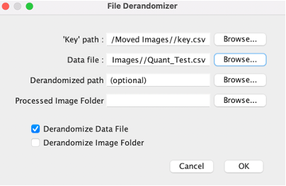
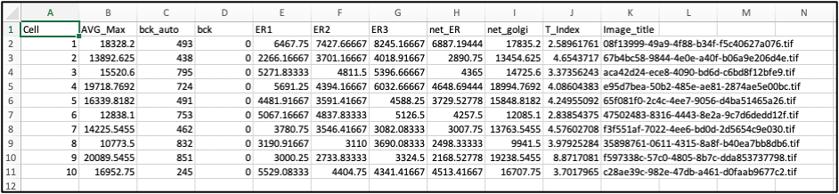
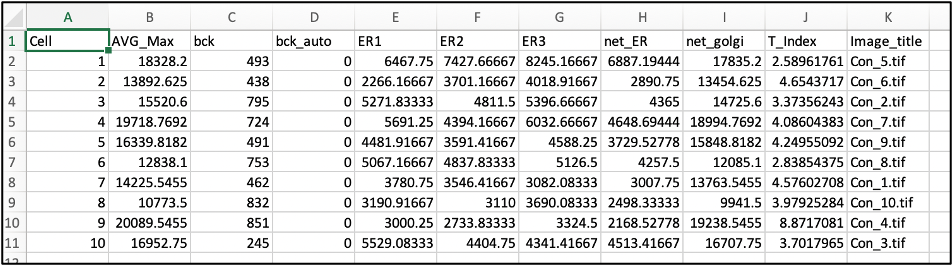

--Hay-Lab_plugins-- 
**File Derandomizer:** 
 
**Key path:** path to key.csv file. 
**Data file:** path to the data file that includes randomized names. 
**Derandomized path:** path for File Derandomizer output. Default is the path to Data file. 
**Processed Image Folder:** path to processed image folder generated in Transport Assay plugin. 
**Derandomize Data File:** if checked will derandomize the selected data file and generate a copy with unscrambled filenames.  
**Derandomize Image Folder:** if checked will derandomize files in the selected directory. 

**Pre-File Derandomizer: Output from Transport Assay plugin:** 
 
**Post-File Derandomizer:** 
 

