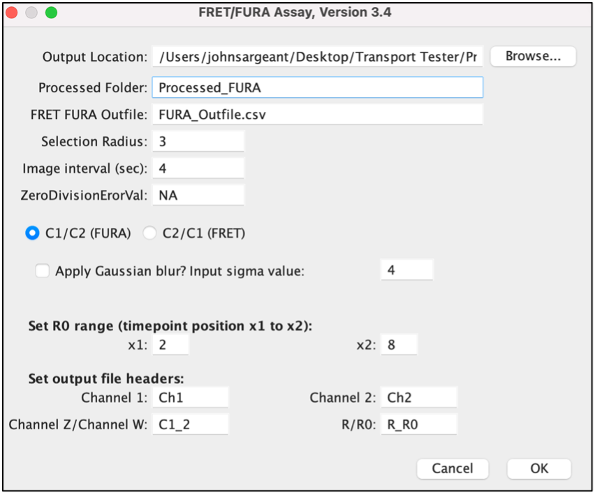
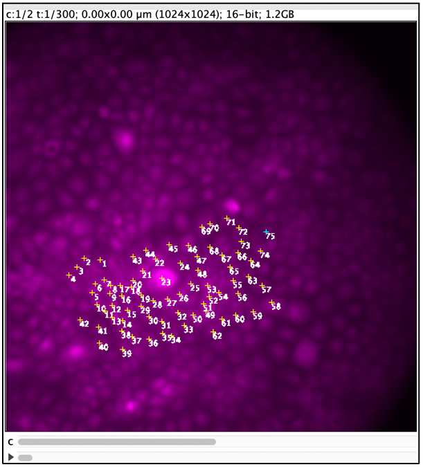
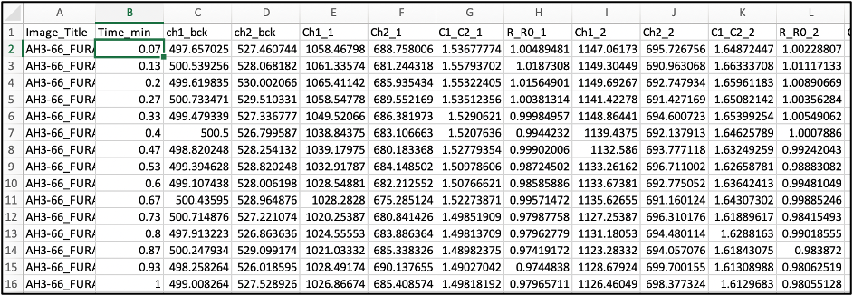

--Hay-Lab_plugins  

**FRET/FURA** 

Description: Calculates the ratio of multiple user defined ROI’s from a dual channel hyperstack (width, height, channels and time frames).  
 
**Output Location:** location of data output.  
**Processed Folder:** name of folder containing processed image (saves ROI overlay). 
**FRET FURA Outfile:** name of file containing ratio data for each ROI. 
**Selection Radius:** radius of ROI’s generated using the multi point tool. 
**Image Interval (sec):** number of seconds between each image interval.  
**ZeroDivisionErrorVal:** output when dividing by zero. 
**C1/C2(FURA):** if checked ROI ratio is channel 1 /channel 2. 
**C2/C1(FRET):** if checked ROI ratio is channel 2 /channel 1. 
**Apply Gaussian blur? Input sigma value:** apply a gaussian blur function prior to data aquistiion. 
**Set RO range (timepoint position x1 to x2):** range of channels used to determine the baseline ratio (R0) 
**Set Output file headers:** headers printed onto an csv file.  

**FRET FURA: ROI selection phase**  
 
**FRET FURA: Output:** 
 

**Image_title:** image that all ROI’s were derived from.  
**Time_min:** time in minutes after acquisition of repeating sets of dual channels. 
**ch1_bck:** background of channel 1. 
**ch2_bck:** background of channel 2. 
**Ch1_(n):**  average intensity of pixels within ROI ‘n’ in channel 1. 
**Ch2_(n):**  average intensity of pixels within ROI ‘n’ in channel 2. 
**C1_C2_(n):** Ch1_(n) / Ch2_(n). 
**R_R0_(n):** (Ch1_(n) / Ch2_(n)) / average intensity of pixels of ROI ‘n’ amassed from positions defined by the R0 range (above). 

