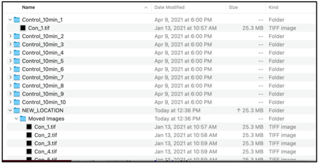

# File Mover:
**Description:**
Searches and copies a group of files, based on the file extension, from one directory to another. This is useful for aggregating all files from a specific experiment into one directory.  
 

 
**File Extension**: file type is defined here. 
**Source**: location of the source directory containing groups of files to be moved. 
**Destination**: destination location of all copied files from the source directory. File Mover will create a new folder called “Moved Images” in the specified destination. Note, if left blank the default destination the “Moved Images directory is the same as the source directory. 

**Pre-File Mover** 
 

**Post-File Mover** 
 

