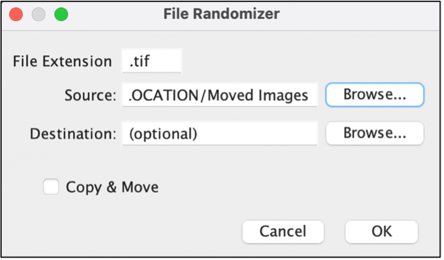
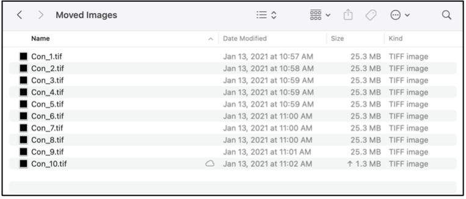
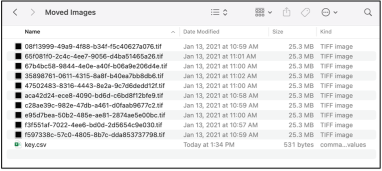
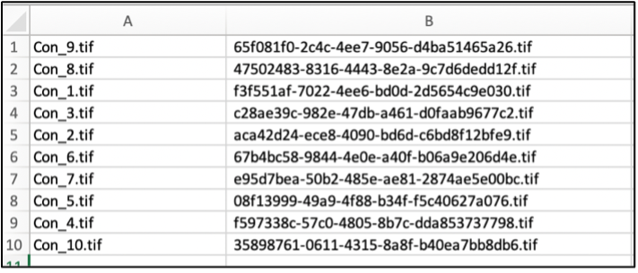

**File Randomizer:**

**Description:**  
For a directory containing no subdirectories, renames files with a randomly generated 36-character filename, consisting of characters (a-f, 0-9, -). Old filenames and new randomized names are stored in a csv file, “key.csv” in the directory folder. This is useful for blinding a researcher from a filename during from image quantitation.  

 

**File Extension:** file type is defined here. 
**Source:** location of the source directory containing groups of files to be randomized. 
**Destination:** use only if “Copy & Move “is checked. Destination location of all files with randomized names from the source directory. 
**Copy & Move:** will make a copy of the source directory prior to renaming files with random designations. 

**Pre-File Randomizer:** 
 

**Post-File Randomizer: Source Directory** 
 

**Post-File Randomizer: key.csv** 
 

