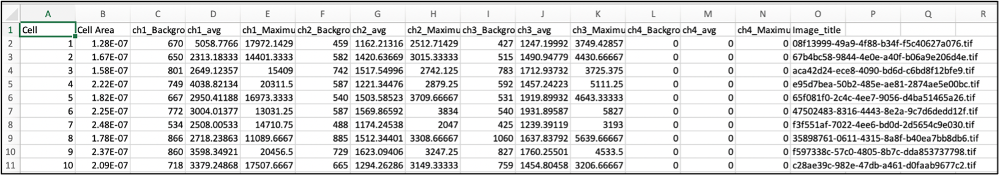

**Transport Assay:**  
**Description:** 
Determines a series of intensity data based upon regions of an image (ROIs). Principally, this assay calculates the ratio of maximum intensity over average intensity. This is useful for determine transport rates of synchronizeable cargo and gathering associated corollary data such as mean or max intensity of an ROI across multiple channels.  

 

**Image Folder:** location of the image file to be assayed. Assigned automatically.  
**Processed Image Folder:** name of folder containing processed images.  
**Transport Output:** name of csv file containing ratiometric output  

------------------------------------------------------------------------------------------------------
**Mean Max Output:** name of csv file containing channel intensity output data. -optional  
**Transport channel:** channel where the ratio of maximum intensity over average intensity is determined.  
**Golgi channel:** channel the golgi apparatus is visible in. -optional.   
**Zoom:** the level of zoom after selection of an image ROI.  
**View Mode:** Look Up Table (LUT) selection.  
**File Type:** extension of the image file type.   
**Processed File Extension:** character added to the start of an image filename after its been processed.  
**ER Selection Radius:** radius of the circular ROI's used to determine average intensity of the ER.  

------------------------------------------------------------------------------------------------------

**Advanced Options:**--will occur if checked.  
**Always Select Golgi:** forces the user to manually determine the region that maximum intensity is derived from.  
**Mean Max Detection:** generates csv file, that records: Area, mean and max intensity of a selected ROI for all channels.   
**Auto Position Image Window:** positions image window at the specified coordinates.  
**Always Auto-Detect Golgi:** automatically determines the maximum intensity of an ROI in the transport channel.   
**Manual Background Selection:** forces the user to manually assign a background value. If unchecked lowest pixel intensities will be assigned automatically.    

**ER-to-Golgi Transport Assay:** ER selection phase of selected ROI  

 

**ER-to-Golgi Transport Assay:** Transport Output csv  
 
**Cell:** ROI number assayed. 
**AVG_Max:** average of the top .01% of pixels in selected ROI. 
**bck_auto:** average of the bottom .1% of pixels in selected ROI. 
**bck:** manually selected background. 
**ER1:** average pixel intensity in the first selected circular ROI. 
**ER2:** average pixel intensity in the second selected circular ROI. 
**ER3:** average pixel intensity in the third selected circular ROI. 
**net_ER:** average of ER regions 1-3. 
**net_golgi:** AVG_Max-bck_auto. 
**T_index:** net_golgi/net_ER. 
**Image_title:** image that a particular ROI was derived from.  

**ER-to-Golgi Transport Assay:** Mean Max Output csv 
 
**Cell:** ROI number assayed. 
**Cell Area:** area of selected ROI, determined by FIJI’s measure function. 
**ch1_Background:** minimum of selected ROI in channel 1. Determined by FIJI’s measure function. 
**ch1_avg:** mean of selected ROI in channel 1. Determined by FIJI’s measure function. 
**ch1_Maximum:** maximum of selected ROI in channel 1. Determined by FIJI’s measure function. 
…… 
**Image_title:** image that a particular ROI was derived from.  

